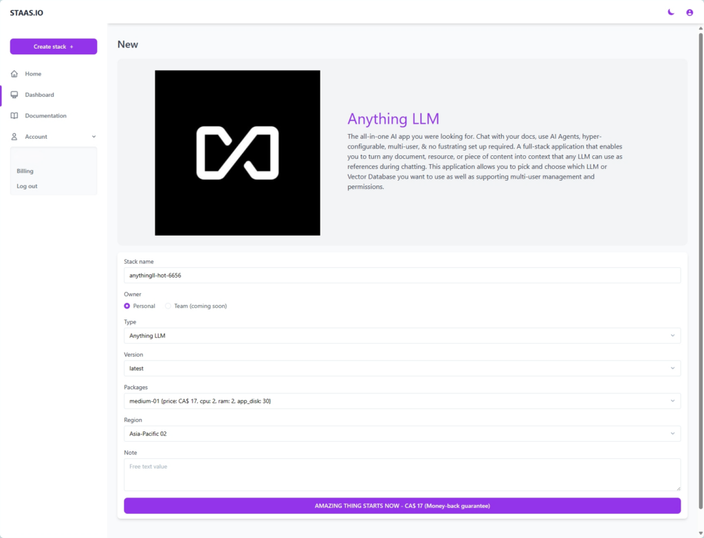
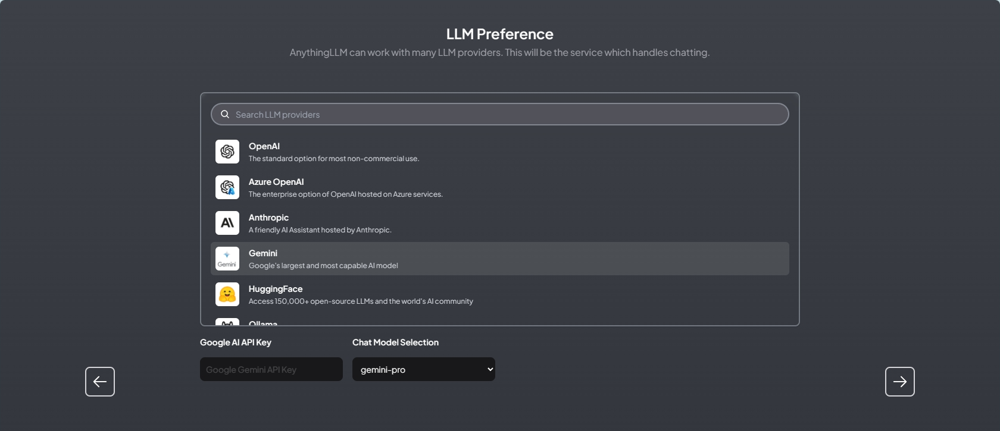
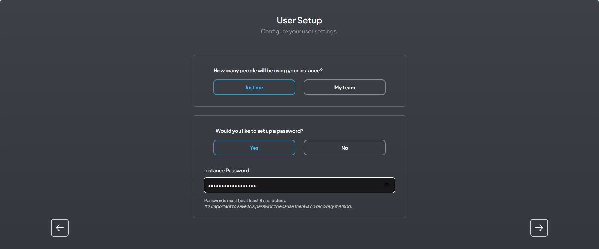
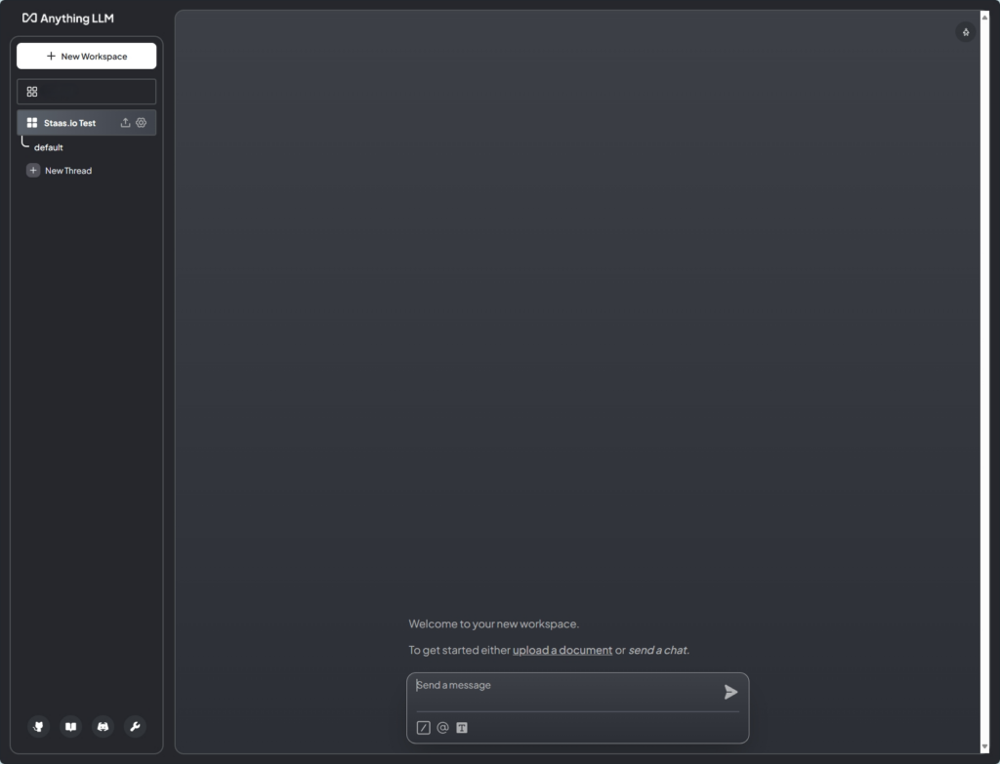
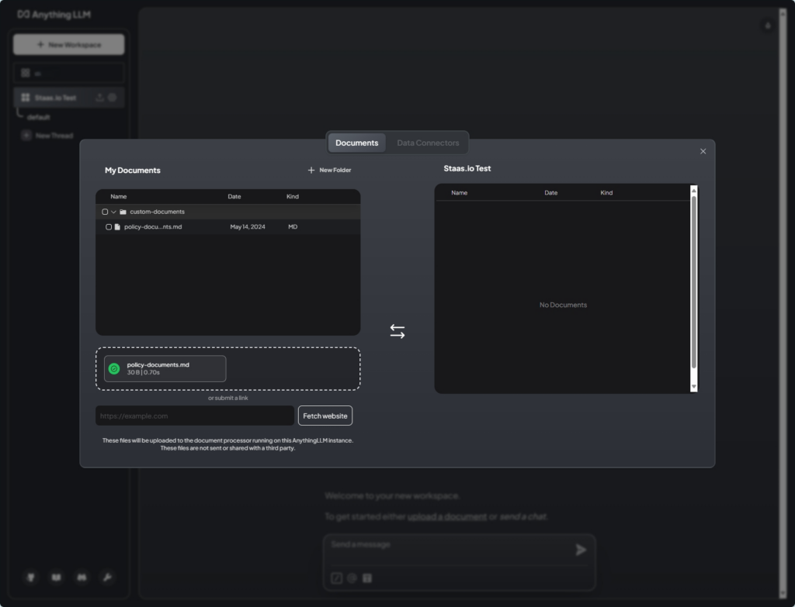
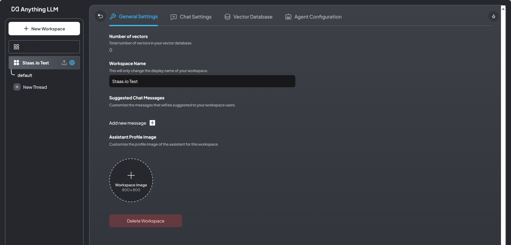
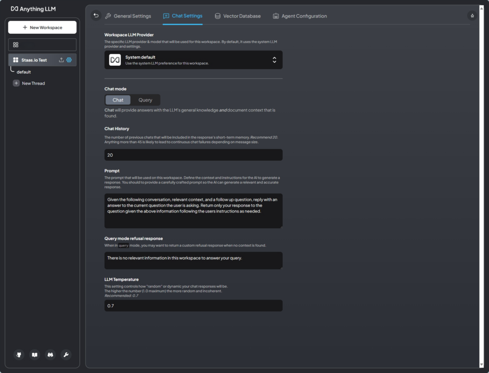
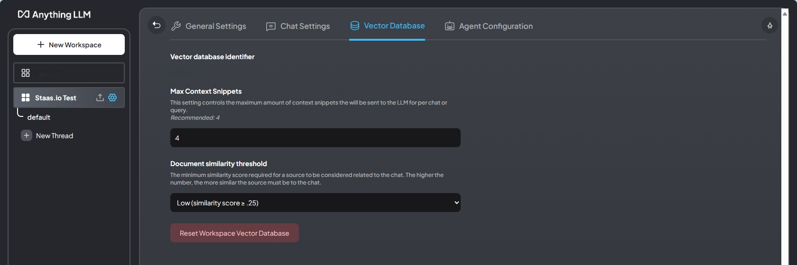
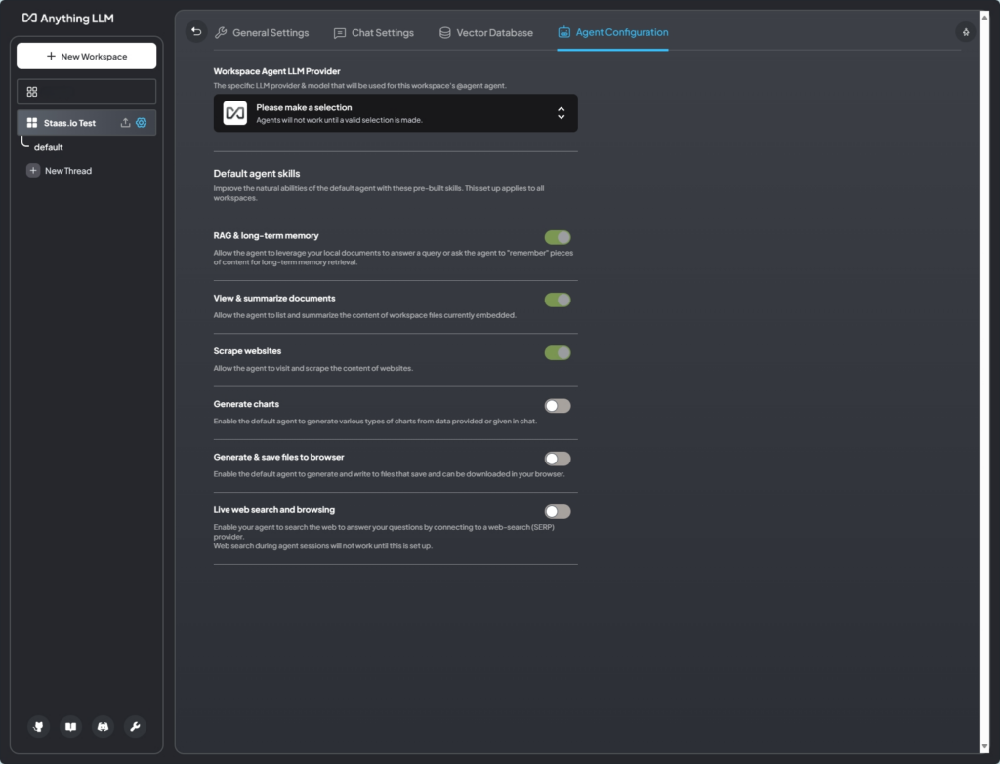

# Introduction
Complete this tutorial to deploy a sample AnythingLLM app via Staas.io without any additional tool/knowledge.

Requirements:
- A verified Staas.io account.

## Creating your first Stack with Staas.io

The all-in-one AI app you were looking for. Chat with your docs, use AI Agents, hyper-configurable, multi-user & no fustrating set up required. A full-stack application that enables you to turn any document, resource, or piece of content into context that any LLM can use as references during chatting. This application allows you to pick and choose which LLM or Vector Database you want to use as well as supporting multi-user management and permissions.

### Instance Creation
Staas.io gives you more controls with the instance you run your app on.

Getting started with AnythingLLM on Staas.io is a straightforward process that opens up a world of possibilities for interacting with your documents. Here's a step-by-step guide to help you begin:

**Step 1**: Log in to your [Staas.io Dashboard](https://www.staas.io/dashboard/create_stack?project_type=anythingllm&utm_source=docs&utm_content=textlink).

**Step 2**: Configure your stack instance: name, package and region. For optimal performance, select either the `medium-02` or `high-01` package. Then, initiate your app creation with a simple click of the button.

In the Create Stack page, configure your stack:
- **Stack name**: This is your stack name. It is also the name of your web domain once the stack is created.
- **Owner**: Set it as a private or a shared stack so that your team can contribute and maintain.
- **Type**: This is The stack type. It is the same as the previous page. In this case, Python is already selected.
- **Version**: Select a Python's version. Let's select Python 3.9.9 for our example.
- **Packages**: This is your instance type. Choose your desired hardware's capability. The options are limited to your [Pricing plan](https://www.staas.io/#pricing).
- **Region**: Choose a region to deploy your stack. The app should be deployed closest to your target customers.

Press Create and your stack will be created momentarily. An email will be sent to you once it is created and ready to run.

**Step 3**: Sit back and relax, your AnythingLLM stack is being assembled! Once ready, simply click [Domain](){: .btn .btn-purple .ml-2 } button to be whisked away to your brand-new AnythingLLM web application!

### Manage your Stack in the Dashboard
Once you created the stack, you will be greeted with a Stack Management screen.

Checking out your new domain by clicking on [Domain](){: .btn .btn-purple .ml-2 } button. It will open up your designated domain in a new tab.

## Setting Up Your AnythingLLM Chat Assistants

**Step 1**: Selecting Your Preferred Language Model
The first step in setting up *AnythingLLM* is to choose the language model that best suits your needs. *Currently, Anything LLM supports three models: OpenAI, Azure, and Anthropics Claw V2*. Each model offers unique features and advantages, so consider what's most important for your use case. Note that for models other than OpenAI, you may need to apply for access.

**Step 2**: Configuring User Instances
Whether you're working alone or with a team, *AnythingLLM accommodates both single-user and multi-user instances*. If you're the only user, simply select the "Just Me" option and secure it with a password. For team environments, choose the "Team" option to create user accounts, assign roles, and manage permissions, fostering a collaborative workspace.

**Step 3**: Establishing Workspaces

You will be greeted with the welcome screen. Here you can start chatting right away with your assistant:

Or you can upload your documents via the "Upload documents" screen:

Workspaces in *AnythingLLM* act as containers for your document collections, facilitating conversations around specific topics or use cases. Create and customize workspaces to suit your needs, including naming them, adjusting settings like temperature, and setting up prompts to guide your language model.

Click on the gear icon next to your workspace's name to configure your workspace:

By following these steps, you'll be well on your way to leveraging the full potential of AnythingLLM for engaging and insightful document interactions.

Congratulations, you have successfully deployed your Shiori app through just a few steps with Staas.io

Launch your online journey with AnythingLLM today by visiting [Staas.io](https://www.staas.io/dashboard/create_stack?project_type=anythingllm&utm_source=docs&utm_content=textlink) – where possibilities come alive!
