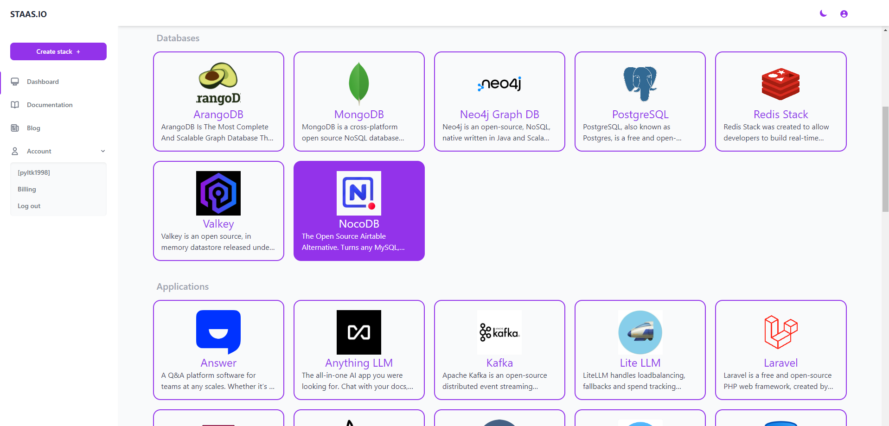
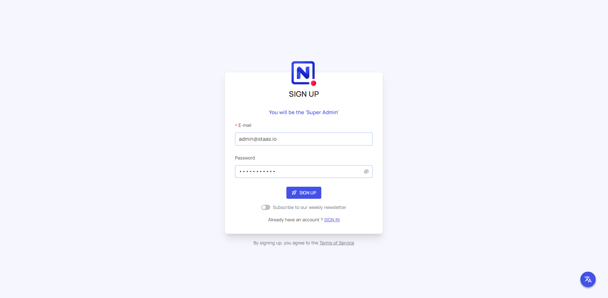
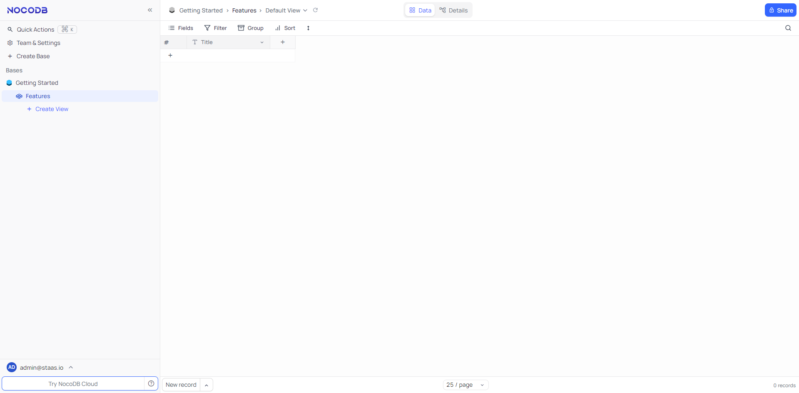

# Introduction
Complete this tutorial to deploy a sample NocoDB app via Staas.io without any additional tool/knowledge.

Requirements:
- A verified Staas.io account.

## Creating your first Stack with Staas.io

NocoDB is arguably the most popular self-hosted Airtable alternative and its feature set is evidence as to why with support for various views (gallery, Kanban, forms, calendar), a mature API, and a small app (integration) store. The platform has a modern, minimal design and makes navigating, sorting, and grouping trivial as the various views are traversed.

### Instance Creation
Staas.io gives you more controls with the instance you run your app on.

Go to your [Staas.io Dashboard](https://www.staas.io/dashboard)

Click on "Create new stack +".
From this screen, you can select your stack of choice including Programming Languages, Databases and Applications. In this tutorial, we'll select **NocoDB**.

In the Create Stack page, configure your stack:
- **Stack name**: This is your stack name. It is also the name of your web domain once the stack is created.
- **Owner**: Set it as a private or a shared stack so that your team can contribute and maintain.
- **Type**: This is The stack type. It is the same as the previous page. In this case, Python is already selected.
- **Version**: Select a Python's version. Let's select Python 3.9.9 for our example.
- **Packages**: This is your instance type. Choose your desired hardware's capability. The options are limited to your [Pricing plan](https://www.staas.io/#pricing).
- **Region**: Choose a region to deploy your stack. The app should be deployed closest to your target customers.

Press Create and your stack will be created momentarily. An email will be sent to you once it is created and ready to run.

### Manage your Stack in the Dashboard
Once you created the stack, you will be greeted with a Stack Management screen.

Checking out your new domain by clicking on [Domain](){: .btn .btn-purple .ml-2 } button. It will open up your designated domain in a new tab.

## Set up your NocoDB page
You will be greeted with a installation process to setup your NocoDB page.

When you open the NocoDB app for the first time, you will see the account registration page, you need to fill in your email and password information (this will be the information for you to log into NocoDB later, this account will default to Super Admin of NocoDB, you need to keep this account information secure)

Once you have finished, you will be on your **NocoDB Dashboard**.

Congratulations, you have successfully deployed your NocoDB app through just a few steps with Staas.io
